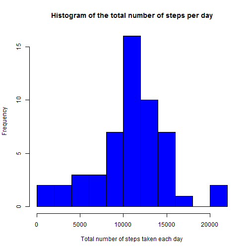
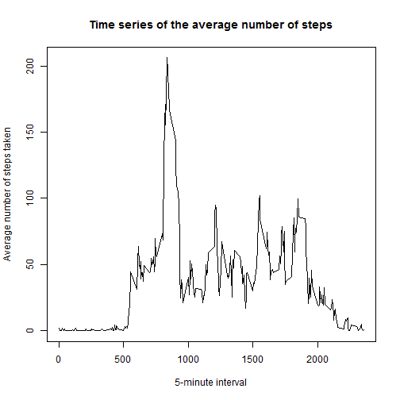
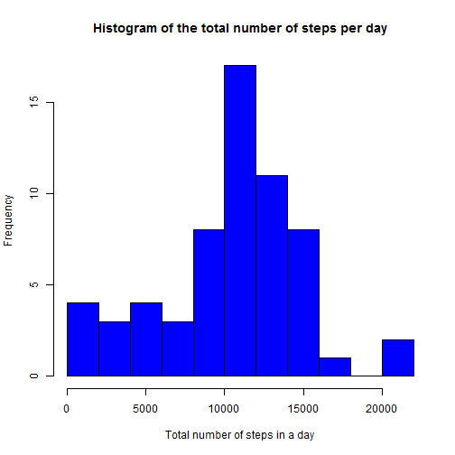
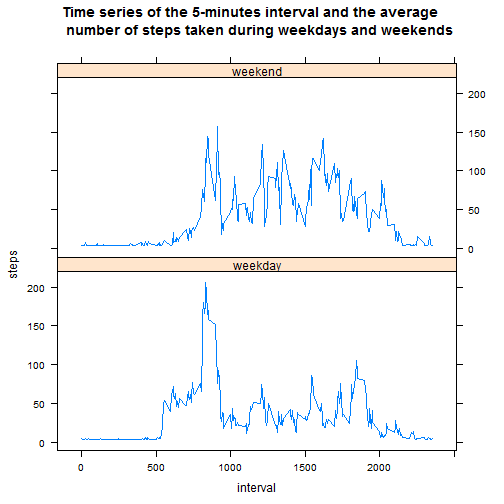

Description: this report has been created for the Coursera course project "Reproductible Research: Peer assessment 1".

## Loading and preprocessing the data
1. Load the data (i.e. read.csv())
2. Process/transform the data (if necessary) into a format suitable for your analysis


```r
unzip(zipfile="repdata-data-activity.zip")
ds <- read.csv("activity.csv")
# Set local time in order to have the names of the days in English and not French
Sys.setlocale("LC_TIME", locale="USA")
```

```
## [1] "English_United States.1252"
```

## What is mean total number of steps taken per day?
1. Calculate the total number of steps taken per day
2. If you do not understand the difference between a histogram and a barplot, research the difference between them. Make a histogram of the total number of steps taken each day


```r
tot_num_steps <- aggregate(steps~date, data=ds, FUN=sum, na.rm=TRUE)
hist(tot_num_steps$steps, breaks=10, col='blue', main="Histogram of the total number of steps per day"
     , xlab="Total number of steps taken each day")
```

 

3. Calculate and report the mean and median of the total number of steps taken per day

Mean:

```r
mean(tot_num_steps$steps, na.rm=TRUE)
```

```
## [1] 10766.19
```

Median:

```r
median(tot_num_steps$steps, na.rm=TRUE)
```

```
## [1] 10765
```

## What is the average daily activity pattern?

1. Make a time series plot (i.e. type = "l") of the 5-minute interval (x-axis) and the average number of steps taken, averaged across all days (y-axis)


```r
avg_steps <- aggregate(steps~interval, data=ds, FUN=mean, na.rm=TRUE)
plot(avg_steps, type="l", main="Time series of the average number of steps"
    , xlab="5-minute interval", ylab="Average number of steps taken")
```

 

2. Which 5-minute interval, on average across all the days in the dataset, contains the maximum number of steps?

The following interval starting with **835** and ending with **840** contains the maximum number of steps.

```r
avg_steps[which.max(avg_steps$steps),1]
```

```
## [1] 835
```

```r
avg_steps[which.max(avg_steps$steps)+1,1]
```

```
## [1] 840
```

## Imputing missing values

Note that there are a number of days/intervals where there are missing values (coded as NA). The presence of missing days may introduce bias into some calculations or summaries of the data.

1. Calculate and report the total number of missing values in the dataset (i.e. the total number of rows with NAs)


```r
ds_na <- sum(is.na(ds$steps))
ds_na
```

```
## [1] 2304
```

2. Devise a strategy for filling in all of the missing values in the dataset. The strategy does not need to be sophisticated. For example, you could use the mean/median for that day, or the mean for that 5-minute interval, etc.

3. Create a new dataset that is equal to the original dataset but with the missing data filled in.

- The missing values will be replaced by mean for that day. If the mean is NA, missing values will be replaced by 0.
- The new data set will be: "ds_complete"


```r
# Store the mean with NA values (option "na.rm = FALSE")
avg_steps_na <- aggregate(steps~date, data=ds, FUN=mean, na.rm=FALSE)

# Create a new data set as a copy of the original data set
ds_complete <- ds

# Make a loop on the NA values of the data set to replace them by:
# - 0 if the mean is NA 
# - The mean of the interval if the mean is not NA
for (i in 1:nrow(ds_complete))
{
    if (is.na(ds_complete$steps[i]))
    {
        if (is.na(avg_steps_na$steps[ds_complete$date[i]]))
        {
            ds_complete$steps[i] <- 0
        }
        else
        {
            ds_complete$steps[i] <- avg_steps_na$steps[ds_complete$date[i]]
        }
    }
}
```

Compare the data sets complete values:

- Data set without missing values replacement


```r
sum(complete.cases(ds))
```

```
## [1] 15264
```

- Data set with missing values replacement

```r
sum(complete.cases(ds_complete))
```

```
## [1] 17568
```

4. Make a histogram of the total number of steps taken each day and Calculate and report the mean and median total number of steps taken per day. Do these values differ from the estimates from the first part of the assignment? What is the impact of imputing missing data on the estimates of the total daily number of steps?


```r
sum_steps <- aggregate(steps~date, data=ds_complete, FUN=sum, na.rm=TRUE)
hist(sum_steps$steps, breaks=10, col="blue", main="Histogram of the total number of steps per day",
     xlab="Total number of steps in a day")
```

 

New mean and median are calculated. As we can see, missing values have an impact on the mean and the median which were previously close.
Indeed, the previous value of the mean was **10766.19** and the median was **10765** whereas now they are equal to **10276.38** for the mean and **10571** for the median --> Both values have decreased.

Mean **with** missing values:

```r
mean(tot_num_steps$steps, na.rm=TRUE)
```

```
## [1] 10766.19
```

Median **with** missing values:

```r
median(tot_num_steps$steps, na.rm=TRUE)
```

```
## [1] 10765
```

Mean **without** missing values:

```r
mean(sum_steps$steps)
```

```
## [1] 10276.38
```

Median **without** missing values: 

```r
median(sum_steps$steps)
```

```
## [1] 10571
```

## Are there differences in activity patterns between weekdays and weekends?

For this part the weekdays() function may be of some help here. Use the dataset with the filled-in missing values for this part.

1. Create a new factor variable in the dataset with two levels - "weekday" and "weekend" indicating whether a given date is a weekday or weekend day.

This new vector variable will be added to the new data set "ds_complete":
- day_type: type of the day (weekday or weekend)


```r
# Calculate the weekdays
day_type <- weekdays(as.Date(ds_complete$date))
# Assign the weekdays and the weekends to the data set
day_type <- ifelse(test = day_type %in% c("Saturday", "Sunday"), yes="weekend", "weekday")
ds_complete$day_type <- as.factor(day_type)
```

2. Make a panel plot containing a time series plot (i.e. type = "l") of the 5-minute interval (x-axis) and the average number of steps taken, averaged across all weekday days or weekend days (y-axis). See the README file in the GitHub repository to see an example of what this plot should look like using simulated data.


```r
avg_steps_int <- aggregate(steps~interval+day_type, data=ds_complete, FUN=mean)

library(lattice)
xyplot(steps~interval|day_type, avg_steps_int, type="l", layout=c(1,2)
    , main="Time series of the 5-minutes interval and the average \
    number of steps taken during weekdays and weekends")
```

 
